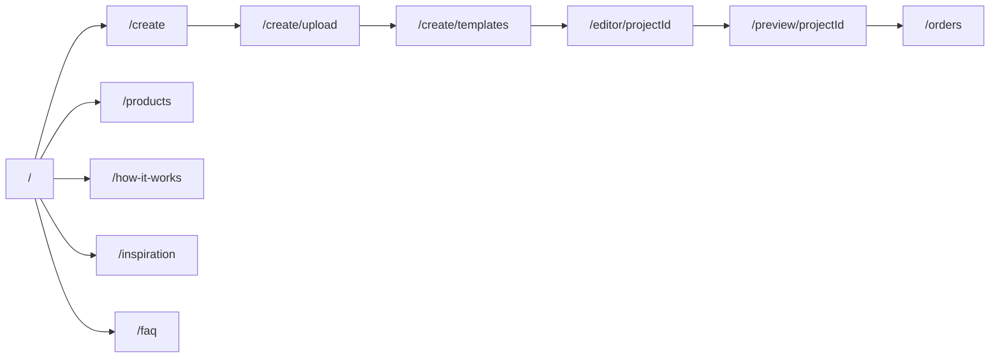

# AksTory Product Development Plan

## Current stack (inspected)

| Area | Reality |
|------|---------|
| Framework | Next.js 16 App Router via **vinext** + Vite 8 |
| Routing | File-based under `app/` (not Vite `src/pages`) |
| Styling | Tailwind 4 + custom tokens in `app/globals.css` + Peyda |
| UI kit | shadcn in `components/ui/` (unused by landing today) |
| Landing | Monolith: `app/page.tsx` |
| Data / DB | Drizzle schema empty; no product persistence yet |
| Hosting | Cloudflare Worker (`worker/index.ts`) |

**Decision:** Do **not** move the app into a Vite-style `src/pages` tree. That would rewrite routing. Instead map the product architecture onto App Router and grow `components/`, `features/`, and `data/` beside existing folders.

## Target folder map

```
app/
  page.tsx                 → Home (concise)
  create/page.tsx          → Story + book type wizard
  create/upload/page.tsx
  create/templates/page.tsx
  editor/[projectId]/page.tsx
  preview/[projectId]/page.tsx
  products/page.tsx
  how-it-works/page.tsx
  inspiration/page.tsx
  faq/page.tsx
  account/page.tsx
  projects/page.tsx
  orders/page.tsx
components/
  layout/                  → SiteHeader, SiteFooter, Announcement
  home/                    → Hero, HowPreview, FeaturedTemplates, Benefits, FinalCta
  create/                  → Wizard steps UI
features/
  create-book/             → Draft state, upload helpers
  editor/                  → Canvas MVP (Konva later)
  templates/
  orders/
data/                      → Static catalogs (templates, products, faqs)
lib/                       → Existing utils + project draft store
hooks/
public/fonts/peyda/
public/images/
```

## Route map



## Phased delivery

### Phase 0 — Foundation (this increment)
- Document architecture
- Shared layout components
- Route shells for all product URLs
- Keep Home visual identity; wire primary CTAs to `/create`
- Centralize static data in `data/`

### Phase 1 — Concise Home
- Hero + 3-step preview + featured templates + 3 benefits + final CTA
- Move long FAQ / quality / full how-to off Home into dedicated routes

### Phase 2 — Create wizard (`/create`)
- Story type cards → book type (Classic / Premium) → continue to upload
- Persist draft in `localStorage` JSON

### Phase 3 — Upload (`/create/upload`)
- Drag-drop, preview grid, remove, reorder, counter (client-side blobs)

### Phase 4 — Templates (`/create/templates`)
- Category filter + cards → create projectId → `/editor/[id]`

### Phase 5 — Editor MVP (`/editor/[projectId]`)
- Toolbar / sidebar / canvas / page thumbs
- Add Konva when canvas interaction starts
- Save JSON project state locally first

### Phase 6 — Preview (`/preview/[projectId]`)
- Cover + pages + price estimate + edit / order actions

### Phase 7 — Marketing pages
- `/products`, `/how-it-works`, `/inspiration`, `/faq` with real content

### Phase 8 — Account surfaces (stubs → real later)
- `/account`, `/projects`, `/orders` (demo data until auth/DB)

## Brand constraints

Keep: cream/clay/teal palette, Peyda weights, button/card language, RTL, emotional minimal editorial tone.  
Do not: clone Pixory visuals, crowded print-shop UI, rewrite globals tokens.

## Persistence strategy (incremental)

1. **Now:** `localStorage` project draft (`akstory.draft.v1`)
2. **Later:** D1 + R2 via existing worker bindings when auth exists

## Non-goals for early phases

- Real payments
- Real print pipeline
- Full auth
- Over-engineered editor before MVP canvas works
